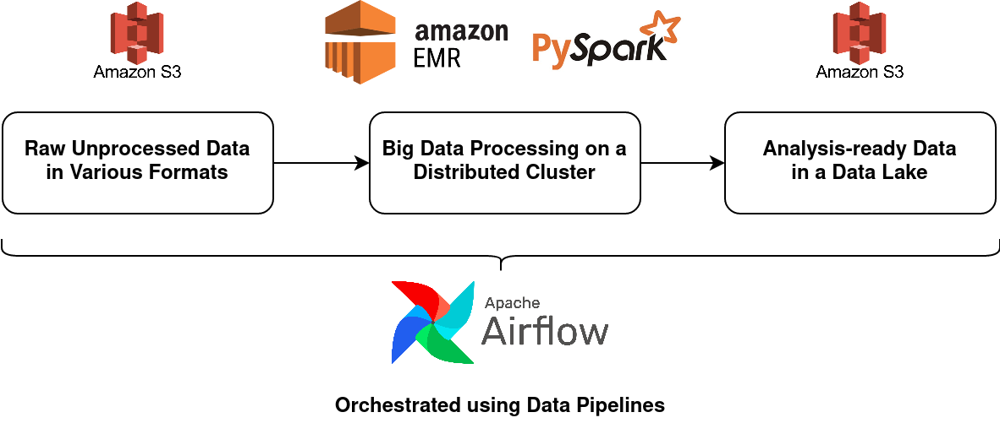
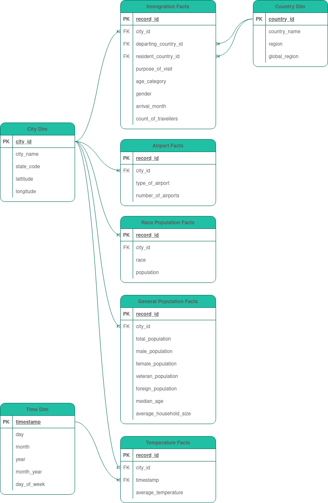
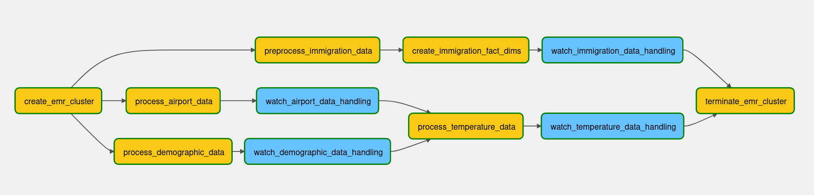
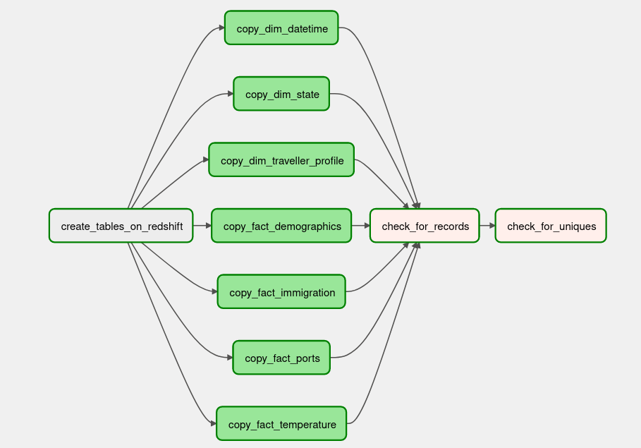

# Udacity Capstone Project: US Immigration, Demographics, and Climate Change

This is the Capstone Project of the Udacity Data Engineering Nanodegree.

# Project Summary

The purpose of this project is to extract and transform US foreign immigration, demographic, and temperature data and load it into a relational database for use by a team of climate scientists who are interested in exploring the relationships between climate change, foreign travel, and the demographic composition of all US states.

It's important to note that the goal of the project is to not run the analyses, but to provide the fundamental data required for the comparisons. 

# Scope of the Project

## Scope

The scope of this project is to provide a team of climate scientists access to analysis-ready and pre-aggregated data that would allow them to: 
1. Identify US states with the greatest changes in yearly temperature over the decades (using either minimums, maximums, averages, or medians)
2. Investigate the following characteristics of each of these US states:
    * The daily volumes of various types of travellers in terms of mode of travel, travel purpose, gender, citizenship region
    * The composition of a state's population in terms of gender, race, citizenship, veteran status, and average household size
    * The variety and number of air transportation ports

Our climate scientists only have a working knowledge of SQL and thus they'd like a relational database that they can easily query without a significant number of joins or aggregations.

## Technology

This project will make use of an AWS S3 Bucket, AWS EMR, PySpark, AWS Redshift, and Airflow.



* The raw data that requires transformation will be held on an **AWS S3 Bucket**.
* The analysis-ready datasets will be stored in a relational database held using **AWS Redshift**.
    * We're using a relational database since we're going to model our data into a star schema with several fact tables containing pre-aggregated metrics.
    * While a data lake using S3 buckets would have been an inexpensive option, Redshift will allow the scientists to interact with the data using a language they're more familiar with - SQL - and scale their operations across a cluster of computers (if needed).
* Since we're dealing with large datasets, an **AWS EMR Cluster** along with **PySpark** will be used to clean and aggregate the data before it is passed into the relational database. 
    * We're using AWS EMR since we'll need access to a distributed network of computers to crunch our data. We can also easily scale our EMR instance by adding more nodes if we need additional computing power. We can shut our EMR instance down each time we're done processing the data, so we're not spending money on idle resources.
    * We're using PySpark (or Python's wrapper for Spark) to distribute the job of cleaning and aggregating the data to each of the nodes in our distributed network of computers. Our data operations will be memory-intensive and PySpark makes more efficient use of memory compared to other big data technologies like Hadoop MapReduce.
* Since we'll be running a host of operations on our data - reading, cleaning, transforming, writing, etc., - we'll need to use a tool to monitor the progress of each of these tasks. The tool we've chosen for this is **Airflow** which allows us to easily define the tasks within a data pipeline and monitor their execution.

## Data

We have 4 datasets provided by Udacity:

* **I-94 Immigration Data**: This data was gathered by the US National Tourism and Trade Office. An I-94 is a form issued to all foreign visitors to the United States at the country's ports of entry. The data spans the year 2016 and contains (but is not limited to): 
    * The traveller's personal details such as their country of citizenship, resident country, gender, age, and birth year.
    * Their travel details such as their mode of travel, their airline and flight number, their port of entry, their date of arrival, the final date before which they must depart the US, their arrival status, and their departure status.
    * Their visa details such as the type of their visa, their purpose in the country, and the department of state that issued their visa.
* **US City Demographics**: This data was published by OpenDataSoft. It contains demographic information for 2,891 cities across the United States. The dataset is comprised of numerical information such as median age, gender-based population figures, average house-hold size, number of veterans, number of foreign-born residents, and a breakdown by race.
* **Airport Codes**: This data was published on DataHub.io. It contains, primarily codified, information on 55,075 transportation ports (i.e., airports, seaports, heliports, and balloonports) around the world. In addition to the name of the port and codes for the countries, regions, municipalities, and continents it belongs to, it also contains its elevation level, location coordinates, and type of port.
* **Global Land Temperature by City**: This data was published by the non-profit, Berkeley Earth. It contains time-series data of the average temperature observed in 3,448 cities across 159 countries spanning the time period 1743 to 2013.

# Data Exploration

An iPython Notebook was used to explore the data (or sample data) and can be found in the following repository location: `/supplementary-scripts/notebooks/data-exploration.ipynb`.

The findings below contain both observations and ideas on how the data should be cleaned or transformed.

### I-94 Immigration Data

* A lot of the data is codified and must be expanded using the reference data provided in the `I94_SAS_Labels_Description.SAS` file. Codified data includes `i94cit`, `i94res`, `i94port`, and `i94mode` among others.
* According to the reference data in the `I94_SAS_Labels_Description.SAS` file, some of the codes are invalid or should not be used. For key fields like `i94port`, these must be removed from the dataset so eventual analyses aren't based off erroneous data.
* The `arrdate` or arrival date is stored as an SAS numeric date. This means it indicates the number of days either before (negative values) or after (positive values) the 1st of January, 1960.
* There are fields that are codified but have no reference data in the `I94_SAS_Labels_Description.SAS` file. The fields include (but are not limited to): `occup`, `entdepa`, `entdepd`, and `entdepu`.
* Less than 0.01% of records in the sample dataset do not have an `i94mode` value. But more than 99% of records do not have an `occup` value, `insnum` value or an `entdepu` value. The nulls are unlikely missing values and more than likely have a meaning. Nevertheless, these aren't necessary for our project's analytics use cases.
* However, 13.38% of records do not have a `gender` value. These will need to be filled in. Since we can't infer the gender, we could fill it in with a "U" for "Unknown".
* The parquet file-based sample dataset provided alone was very large. We cannot clean and aggregate this data on a single machine.

### Airport Codes Data

* The dataset contains non-US ports as well which will need to be filtered out.
* The state of the US port is included in the `iso_region` column following a hyphen. It'll need to be split out. There are no records without `iso_region` values.
* The majority of medium and large airports have `iata_code` values but only around 12% of small airports have IATA codes. This is to be expected since only major airports would have an IATA code.
* The `municipality` field refers to the city in which the port is located.

### US City Demographics

* Very few records (16) in the dataset contain nulls.
* The dataset is relatively clean but we have aggregated values such as `Median Age` and `Average Household Size` that would be difficult to roll-up to a state-level. We may need to calculate the total number of households and then divide it by the total population. We could do the same for `Median Age` using it as a proxy for average age.
* The city-wise data has been largely duplicated due to the presence of the population by race numbers. Except for `Count`, the data isn't segmented by race so it simply repeats for each race value. We'll need to split the race figures out and de-duplicate the remaining data before rolling it up to a state-level.
* The table doesn't contain demographic information on every city in each state. As a result, our state-level aggregations will be understated.

### Global Land Temperature by City

* This data contains non-US records as well. These will need to be filtered out.
* Unfortunately there's no field for US state, so we'll need to combine this with another source to be able to aggregate to a state-level (we could use the city and state columns in the Demographics data).
* The dataset only contains observations from the late 1700s until 2013. We don't have observations in 2016 which is the reference time period for all the other datasets we're working with. Nevertheless, we can generate yearly summary statistics with what we've got.

### Cross-File Observations

* Unfortunately `i94port` in the Immigration dataset does not correspond to either `local_code` or `iata_code` in the Airport Codes dataset. This effectively means that we would need to spend a significant amount of time manually mapping the `i94port` values to `municipality` values in the Airport Codes dataset (which in turn can be used to map both datasets, at a city level, to the Temperature data and Demographic data). However, since we're only interested in state-level aggregations, this is beyond the scope of the project.

# The Data Model

## Conceptual Data Model

The data model will follow a Star Schema with 4 Fact Tables and 3 Dimension Tables. 

This structure will make it highly convenient for the climate scientists to quickly pull the data points they require for their analyses with minimal joins and aggregations. Furthermore, at this level of aggregation, the data is bound to be of smaller size and thus queries are likely to return results much faster.



The **fact_immigration** table is a fact table that consists of:
* *state_id*: The two-letter identifier for a US state
* *arrival_date*: The date the travellers arrived in the US
* *profile_id*: The identifier for a unique combination of gender, age category, and citizenship region 
* *all_travellers*: The number of travellers that arrived in the state (on a particular day and fitting a particular profile)
* *land_travellers*: The number of travellers that arrived by land
* *sea_travellers*: The number of travellers that arrived by sea
* *air_travellers*: The number of travellers that arrived by air
* *business_travellers*: The number of travellers that arrived for business purposes
* *pleasure_travellers*: The number of travellers that arrived for holiday or leisure purposes
* *student_travellers*: The number of travellers that arrived for the purpose of study

The **fact_ports** table is a fact table that consists of:
* *state_id*: The two-letter identifier for a US state
* *port_type*: The type of air transportion port (e.g. small/medium/large airport, balloonport, etc.)
* *num_of_ports*: The number of air transportation port by type and state

The **fact_demographics** table is a fact table that consists of:
* *state_id*: The two-letter identifier for a US state
* *total_pop*: The total population of the state (for major cities only)
* *male_pop*: The number of men in the state (for major cities only)
* *female_pop*: The number of women in the state (for major cities only)
* *veteran_pop*: The number of war veterans in the state (for major cities only)
* *foreign_pop*: The number of foreign residents in the state (for major cities only)
* *hispanic_pop*: The number of Hispanics or Latin Americans in the state (for major cities only)
* *white_pop*: The number of Caucasians in the state (for major cities only)
* *asian_pop*: The number of Asians in the state (for major cities only)
* *black_pop*: The number of black or African Americans in the state (for major cities only)
* *native_pop*: The number of American Indians or Native Alaskans in the state (for major cities only)
* *avg_hh_size*: The average size of the state's households (for major cities only)
* *total_hh*: The number of households in a state (for major cities only)

The **fact_temperature** table is a fact table that consists of:
* *state_id*: The two-letter identifier for a US state
* *year*: The year of the observations
* *observation_count*: The number of observations recorded
* *num_of_cities*: The number of cities the observations were recorded at
* *min_temp*: The minimum temperature recorded
* *max_temp*: The maximum temperature recorded
* *avg_temp*: The mean temperature recorded
* *median_temp*: The median temperature recorded

The **dim_state** table is a dimension table that consists of:
* *state_id*: The two-letter identifier for a US state
* *state_name*: The full name of a state

The **dim_datetime** table is a dimension table that consists of:
* *timestamp*: The full timestamp containing the month, year, and day value
* *day*: The day component of the timestamp
* *month*: The month component of the timestamp
* *year*: The year component of the timestamp
* *month_year*: A combination of the month component and year component
* *day_of_week*: An indicator from 1 to 7 signifying the day of the week a timestamp falls into

The **dim_traveller_profile** table is a dimension table that consists of:
* *profile_id*: The identifier for each profile
* *gender*: The gender a traveller identifies as either male, female, or other
* *age_category*: The age category the traveller falls into (as of 2016)
* *citizen_region*: The particular continent in the world the traveller is a citizen of (i.e., Asia, Africa, Oceania, etc.)
* *citizen_global_region*: Whether the traveller belongs to the global north or the global south

## Structure of the Data Pipelines

There'll be two pipelines:
* The `prepare-data-for-redshift` pipeline will preprocess the raw data (reading it in from S3), transform it into the fact and dimension tables outlined above, and save them  as`.csv` files on S3.
* The `load-data-into-redshift` pipeline will create a schema on Redshift, load the fact and dimension tables (from S3) into it, and perform checks for completeness and uniqueness.

### The `prepare-data-for-redshift` Pipeline



This pipeline will utilize Airflow to automatically spin up an EMR cluster and add the following Spark jobs (detailed below) as steps before terminating the cluster. This will ensure we don't overspend on big data processing.

*Note: The `watch_` tasks above are `EmrStepSensor` tasks that monitor the progress and status of the previous tasks.*

* The `immigration-data-preprocessing.py` script will perform the following functions:
    * Generate the list of `.sas7bdat` that contain the I-94 Immigration Data and need to be iterated across for the transformationss detailed below.
    * Map the labels for the codified mode, port, visa, and citizenship columns using mapping files that were created using the reference data held on the `I94_SAS_Labels_Description.SAS` file.
    * Preprocess the immigration data by removing irrelevant records, calculating the arrival date, standardizing the gender column, categorizing the ages of the travellers, creating a traveller profile ID (by concatenating sub-strings extracted from the gender, age category, region, and global region columns and labels), and adding month and year columns for partitioning.
    * The preprocessed data will be stored in `.parquet` files on S3 to both minimize space and to be easily accessed by the next Spark job.

* The `immigration-fact-and-dimension-creation.py` script will perform the following functions:
    * Create the immigration fact table in line with the schema above by grouping by the port of entry, profile ID, and arrival date and pivoting by the transportation mode and purpose of visit. An ID column will be added using the `monotonically_increasing_id()` Spark function. A month and a year column will be calculated for partitioning purposes.
    * Create the traveller profile dimension table by simply selecting the distinct combinations of profile ID, gender, age category, region, and global region.
    * Create the datetime dimension table by obtaining a unique list of arrival dates and extracting various date components from them. Create duplicate month and year columns for partitioning (since these are dropped when saved by Spark and unlike Spark, Redshift can't read them in from the partitioned folder structure).
    * All of the above will be stored in `.csv` files on S3.

* The `airport-codes-processing.py` script will perform the following functions:
    * Process the data by filtering out non-US ports, extracting the state ID from the `iso_region` column, and dropping any records with non-standard state IDs.
    * Prepare the ports fact table by getting a count of all records grouped by state ID and type of port. An ID column will be added using the `monotonically_increasing_id()` function.
    * Prepare a state-and-city lookup table (the first of two) to be used to assign state IDs to the city names in the Temperature dataset.
    * The tables will be stored as `.csv` files on S3.

* The `demographic-data-processing.py` script will perform the following functions:
    * Prepare a state-and-city lookup table (the second of two) to be used to assign state IDs to the city names in the Temperature dataset.
    * Prepare the state dimension table by simply getting the distinct combinations of state ID (the 2-letter abbreviation of a state's name) and state name.
    * Create the demographics fact table by splitting the race data out from the table before dropping duplicate city-wise records, calculating the total number of households by city, grouping much of the numerical data by state ID, and calculating average household size by state. The split out race data will be pivoted so it can be merged with the other data at a state ID level.
    * The tables will be stored as `.csv` files on S3.

* The `temperature-data-processing.py` script will perform the following functions:
    * Preprocess the data by filtering out non-US records, combining the two state-and-city lookup tables (dropping duplicates), and mapping in the state IDs for each city.
    * Create the temperature fact table by extracting the year from the date, calculating the number of cities and observations per state, and calculating yearly summary statistics (mean, median, minimum, and maximum) on the average temperature column for each state. An ID column will be added using the `monotonically_increasing_id()` function. A duplicate year column will be created for partitioning (since these are dropped when saved by Spark and unlike Spark, Redshift can't read them in from the partitioned folder structure).
    * The table will be stored as `.csv` files on S3.

### The `load-data-into-redshift` Pipeline



This pipeline will require a Redshift cluster to have already been created. It will:

* Run DDL code to create tables in line with the schema above. Any tables with the same names will be deleted to ensure the data is loaded in fresh.
* Populate each table using its corresponding `.csv` files held on S3.
* Run two types of data checks:
    * The first data check will query every table to ensure it has a non-zero number of records.
    * The second data check will query the primary keys of each table to ensure they are unique by calculating their number of distinct values and comparing it to the number of records in a table.

# Running the Pipelines (ETL Process)

## Requirements

### Initial Data and Scripts on S3

Before we can run any of the pipelines above, we need to first add the raw data files, the mapping files, and the PySpark scripts to an S3 bucket.

1. First create an S3 bucket (I named mine `dendcapstoneproject`).
2. Then create a folder within the bucket called `raw_data` and store the following files in it:
    * `18-83510-I94-Data-2016/`: Folder of data provided by Udacity
    * `airport-codes_csv.csv`: Provided by Udacity
    * `GlobalLandTemperaturesByCity.csv`: Provided by Udacity
    * `us-cities-demographics.csv`: Provided by Udacity
    * `i94cit_labels.csv`: You'll find this in the `/data/additional_data/` folder in this repository. These labels were extracted from the `I94_SAS_Labels_Description.SAS` file.
    * `i94mode_labels.csv`: You'll find this in the `/data/additional_data/` folder in this repository. These labels were extracted from the `I94_SAS_Labels_Description.SAS` file.
    * `i94port_labels.csv`: You'll find this in the `/data/additional_data/` folder in this repository. These labels were extracted from the `I94_SAS_Labels_Description.SAS` file.
    * `i94cit_labels.csv`: You'll find this in the `/data/additional_data/` folder in this repository. These labels were extracted from the `I94_SAS_Labels_Description.SAS` file. The region and global region columns were added using data from Wikipedia and other online sources.
3. Open up the `shared_spark_vars.py` script in the `spark-jobs` folder in this repository and update the `s3_bucket_name` variable with the name of your bucket.
4. Create another folder within the bucket called `scripts` and place all the files in the `spark-jobs` folder in this repository in it (including the amended `shared_spark_vars.py` file).

In the end, your folder structure should resemble the following:

```
--raw_data/

    --18-83510-I94-Data-2016/
        --i94_jan16_sub.sas7bdat
        --i94_feb16_sub.sas7bdat
        --i94_mar16_sub.sas7bdat
        --i94_apr16_sub.sas7bdat
        --i94_may16_sub.sas7bdat
        --i94_jun16_sub.sas7bdat
        --i94_jul16_sub.sas7bdat
        --i94_aug16_sub.sas7bdat
        --i94_sep16_sub.sas7bdat
        --i94_oct16_sub.sas7bdat
        --i94_nov16_sub.sas7bdat
        --i94_dec16_sub.sas7bdat

    --airport-codes_csv.csv
    --GlobalLandTemperaturesByCity.csv
    --us-cities-demographics.csv
    --i94visa_labels.csv
    --i94port_labels.csv
    --i94mode_labels.csv
    --i94cit_labels.csv

--scripts/

    --immigration-data-preprocessing.py
    --immigration-fact-and-dimension-creation.py
    --airport-codes-processing.py
    --demographics-data-processing.py
    --temperature-data-processing.py
    --shared_spark_vars.py
```
### Other AWS Requirements

1. Create an IAM User with the `AdministratorAccess` policy attached. Make sure to save your Access Key and Secret Access Key.
2. Create an IAM Role for Redshift as the Trusted Entity. Attach the `AmazonS3ReadOnlyAccess` policy to it.
3. Create a Security Group to authorize access to a Redshift cluster from either your IP address or anywhere (0.0.0.0/0). The port range should be `5439`.
4. Create a Redshift cluster with the following specifications:
    * Within the same region as your S3 bucket.
    * A Subnet Group that covers all availability zones within the selected region.
    * At least 2 `dc2.large` nodes.
    * Associate the IAM Role created above with it.
    * Make the cluster publicly accessible.

### Airflow Requirements

I chose to set up a development version of Airflow on my own computer and install the packages required for my pipelines. I did this on Pop!_OS 21.10 (Linux) by running the following commands on the terminal:

1. Create an environment variable containing the (future) location of the Airflow directory: `export AIRFLOW_HOME=~/airflow`.
2. Set the PATH variable for Airflow by opening the `.bashrc` file (`gedit ~/.bashrc`) and adding `PATH=$PATH:~/.local/bin` to the end.
3. Install the latest version of airflow for Python 3.9 (change the version number at the very end of the command for a different version of Python): `pip install "apache-airflow==2.2.5" --constraint "https://raw.githubusercontent.com/apache/airflow/constraints-2.2.5/constraints-3.9.txt"`.
4. Install the Postgres providers package: `pip install 'apache-airflow-providers-postgres'`.
5. Install the Amazon providers package: `pip install 'apache-airflow-providers-amazon'`.
6. Initialize the Airflow database: `airflow db init`.
7. Create an admin user: `airflow users create --username <username> --firstname <first_name> --lastname <last_name> --role Admin --email <email_address>`.
8. Now open two terminals.
9. In the first terminal, start the airflow web server on an open port (say 7777): `airflow webserver --port 7777`.
10. In the second terminal, start the airflow scheduler: `airflow scheduler`.

Visit `localhost:7777`, login to Airflow and configure the following connections:

* A connection named `aws_credentials`:
    * The Connection Type should be set to `Amazon Web Services` or `aws` based on the version of Airflow you're using.
    * The Login should be your IAM admin user's Access Key.
    * The Password should be your IAM admin user's Secret Access Key.

* A connection named `aws_redshift`:
    * The Connection Type should be set to `Amazon Redshift`.
    * The Host should be the endpoint of your cluster (without the schema and port number).
    * The Schema should be the name of your database.
    * The Login would be the admin username.
    * The Password would be the admin password.
    * The Port should be the database's port you entered (generally 5439).

* A connection named `pg_redshift`:
    * The Connection Type should be set to `Postgres`.
    * The Host, Schema, Login, Password, and Port should all be the same as the above.

**Note on Redshift Connections:** The reason we have a duplicate Redshift connection with the same details is because one is required for the `S3ToRedshiftOperator` that's provided by the Amazon providers package and the other is required for the inbuilt `PostgresOperator` and `PostgresHook`.

## Executing the Pipelines

1. Copy all the files in the `airflow/dags/` folder in this repository to your own `dags` folder. Make sure to copy the sub-folder called `helpers` that contains the table creation SQL code (`sql_create_tables.py`) and make sure this folder is stored within the `dags` folder as a sub-folder.
2. In the `prepare-data-for-redshift.py` file, change the name of the `s3_bucket` variable to the name of the one you created. Make sure to retain the `s3://` prefix and `/` suffix at the end.
3. In the `load-data-into-redshift.py` file, change the name of the `s3_bucket` variable to the name of the one you created. 
4. Head back into the Airflow web UI and run the DAGs in the following order (you will need to manually trigger the run):
    * First run `prepare-data-for-redshift`.
    * Finally run `load-data-into-redshift`.

### Data Quality Checks

Apart from the explicitly declared variable types in the DDL code that creates the relational tables on Redshift, the `check_for_records` and `check_for_uniques` tasks at the end of the second pipeline will ensure that the data has been loaded into Redshift in the appropriate manner.

### Pipeline Frequency

The pipelines can be run again if the raw datasets are ever updated. For example, if we obtain I-94 Immigration data from 2017 to 2021 or Temperature data for the years following 2013, the raw data files in the S3 `raw_data/` folder can be updated and both pipelines should be executed again in the same order.

### Running Queries

Queries can be run against the data using either Python or the Query Editor that Amazon provides for Redshift.

For example, if our climate scientists, having already identified states with large variances in their average temperatures, wanted to look at the number of foreign travellers to each state as a percentage of the total number of travellers and compare it against the number of foreign residents in each state as a percentage of the total number of foreign residents, they could run the following SQL code:

```sql
WITH t1 AS (
  	SELECT state_id, SUM(all_travellers) AS state_total_travellers
  	FROM fact_immigration
  	GROUP BY 1
),
	t2 AS (
  	SELECT state_id, foreign_pop AS state_foreign_pop
 	FROM fact_demographics
), 
	t3 AS (
  	SELECT state_id, SUM(state_total_travellers) OVER () AS country_total_travellers
    FROM t1
),
	t4 AS (
    SELECT state_id, SUM(foreign_pop) OVER () country_total_foreign_pop
    FROM fact_demographics
)

SELECT t1.state_id,
	t1.state_total_travellers,
    t2.state_foreign_pop,
	ROUND((CAST(t1.state_total_travellers AS DECIMAL) / t3.country_total_travellers) * 100, 4) AS state_traveller_perc,
    ROUND((CAST(t2.state_foreign_pop AS DECIMAL) / t4.country_total_foreign_pop) * 100, 3) AS foreign_pop_perc
FROM t1
JOIN t2 ON t1.state_id = t2.state_id
JOIN t3 on t1.state_id = t3.state_id
JOIN t4 on t1.state_id = t4.state_id
WHERE t1.state_total_travellers IS NOT NULL AND t2.state_foreign_pop IS NOT NULL
ORDER BY 3 DESC;
```

And this would return the following results (this table has been truncated):

|state_id|state_total_travellers|state_foreign_pop|state_traveller_perc|foreign_pop_perc|
|--------|----------------------|-----------------|--------------------|----------------|
|CA      |6518025               |7448257          |18.6349             |31.478          |
|NY      |6297087               |3438081          |18.0033             |14.530          |
|TX      |2388276               |2942164          |6.8280              |12.434          |
|FL      |7811105               |1688931          |22.3318             |7.138           |
|IL      |1577276               |941735           |4.5094              |3.980           |
|AZ      |155407                |682313           |0.4443              |2.884           |

# Changes in Approach Based on Various Scenarios

**What if the data is increased by 100x?**

* We could scale the EMR cluster outwards by running our data transformations and aggregations on a greater number of worker nodes, collectively handling a larger subset of the data at a time.
* We could consider scaling our EMR cluster upwards as well by perhaps creating a cluster with worker nodes that are optimized for memory-intensive tasks.
* If our climate scientists want to increase the granularity of the data (and thereby perform lower-level aggregations), we may need to consider increasing the attached storage space of our Redshift database as well.


**What if the pipelines need to be run on a daily basis by 7am?**

* Since we're already using Airflow, we can simply adjust the `schedule_interval` of the DAGs.
* We can either combine the dags or configure them to run one after the other (for example, setting the second to run 20 minutes after the first, assuming the first doesn't require more than 20 minutes to run).
* We could also add an `sla` to the DAG and add an `email_on_failure` setting so we're immediately informed if the pipelines haven't run by 7am.

**What if the database needed to be accessed by 100+ people?**

* According to [Amazon](https://docs.aws.amazon.com/redshift/latest/mgmt/amazon-redshift-limits.html), Redshift allows for 500 concurrent connections, so our current implementation will allow for the database to be accessed by 100+ people.
* However, with 100+ people querying the data at the same time, we'll probably need to consider adding both more nodes and more powerful nodes to our cluster, especially if the majority of their queries tend to contain a lot of joins and aggregations.
* While Distribution Keys have already been assigned in the DDL for each of the Redshift tables, when we're dealing with larger datasets, we may want to experiment with how the data is distributed and sorted across the Redshift cluster based on the exact queries our climate scientists want to run frequently. This way, we can ensure sure the entire cluster is being used effectively so any complex queries are run efficiently.

---

Disclaimer: This repository was created by Maas Stefan Jaro as part of the Udacity Data Engineering Nanodegree's final requirement - a self-defined Capstone Project.