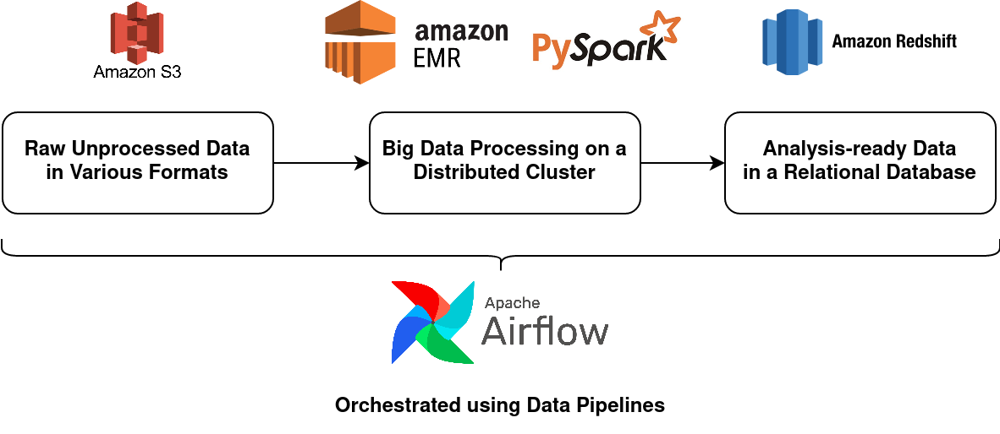

# Udacity Capstone Project: US Immigration, Demographics, and Climate Change

This is a Capstone Project for the Udacity Data Engineering Nanodegree.

# Project Summary

The purpose of this project is to extract and transform US foreign immigration, demographic, and temperature data and load it into a data lake for use by a team of climate scientists who are interested in exploring the relationships between climate change, foreign travel, and the demographic composition of cities and states.

It's important to note that the goal of the project is to not run the analyses, but to provide the fundamental data required for them. 

It is entirely possible that the process documented below may need to be changed if the scientists discover new patterns in the data that had to be taken into account during the ETL process. Many assumptions had to be made during this initial run.

# Scope of the Project

## Scope

The scope of this project is to provide a team of climate scientists access to analysis-ready data that would allow them to primarily determine if US cities and states that have seen greater changes in temperature over the years were subject to relatively more or less foreign citizen immigration.

Furthermore, our climate scientists would also like to determine if there is a correlation between climate change and:
* The types of transportation used
* The broad reasons for immigration
* The demographics of a city and/or state
* The demographics of the travellers (resident country, gender, and age)
* The airline used by foreign travellers
* The number and variety of transportation ports in a city and/or state 

## Technology

This project will make use of AWS S3 Buckets, AWS EMR, PySpark, and Airflow.

* The raw data that requires transformation will be held on an **AWS S3 Bucket**.
* The analysis-ready datasets will be stored in a data lake held within another **AWS S3 Bucket**. 
    * We're using a data lake instead of a database like Redshift to provide the climate scientists greater flexibility over how they query their data given the somewhat loose relationships between the various datasets.
    * We're choosing AWS S3 due to its ease of use and low cost.
* Since we're dealing with large datasets, an **AWS EMR Cluster** along with **PySpark** will be used to clean and aggregate the data before it is passed into the data lake. 
    * We're using AWS EMR since we'll need access to a distributed network of computers to crunch our data. We can also easily scale our EMR instance by adding more nodes if we need additional computing power. We can shut our EMR instance down each time we're done processing the data, so we're not spending money on idle resources.
    * We're using PySpark (or Python's wrapper for Spark) to distribute the job of cleaning and aggregating the data to each of the nodes in our distributed network of computers. Our data operations will be memory-intensive and PySpark makes more efficient use of memory compared to other big data technologies like Hadoop MapReduce.
* Since we'll be running a host of operations on our data - reading, cleaning, transforming, writing, etc., - we'll need to use a tool to monitor the progress of each of these tasks. The tool we've chosen for this us **Airflow** which allows us to easily define the tasks within a data pipeline and monitor their execution.

## Data

We have 4 datasets provided by Udacity:

* **I-94 Immigration Data**: This data was gathered by the US National Tourism and Trade Office. An I-94 is a form issued to all foreign visitors to the United States at the country's ports of entry. The data spans the year 2016 and contains (but is not limited to): 
    * The traveller's personal details such as their resident country, gender, age, and birth year.
    * Their travel details such as their mode of travel, their airline and flight number, departing country, their port of entry, their date of arrival, the final date before which they must depart the US, their arrival status, and their departure status.
    * Their visa details such as the type of their visa, their purpose in the country, and the department of state that issued their visa.
* **US City Demographics**: This data was published by OpenDataSoft. It contains demographic information for 2,891 cities across the United States. The dataset is comprised of numerical information such as median age, gender-based population figures, average house-hold size, number of veterans, number of foreign-born residents, and a breakdown by race.
* **Airport Codes**: This data was published on DataHub.io. It contains, primarily codified, information on 55,075 transportation ports (i.e., airports, seaports, heliports, and baloonports) around the world. In addition to the name of the port and codes for the countries, regions, municipalities, and continents it belongs to, it also contains its elevation level, location coordinates, and type of port.
* **Global Land Temperature by City**: This data was published by the non-profit, Berkeley Earth. It contains time-series data of the average temperature observed in 3,448 cities across 159 countries spanning the time period 1743 to 2013.

# Data Exploration

An iPython Notebook was used to explore the data (or sample data) and can be found in the following repository location: `/supplementary-scripts/data-exploration.ipynb`.

The findings below contain both observations and ideas on how the data should be cleaned or transformed.

### I-94 Immigration Data

* A lot of the data is codified and must be expanded using the reference data provided in the `I94_SAS_Labels_Description.SAS` file. Codified data includes `i94cit`, `i94res`, `i94port`, and `i94mode` among others.
* According to the reference data in the `I94_SAS_Labels_Description.SAS` file, some of the codes are invalid or should not be used. For key fields like `i94port`, these must be removed from the dataset so eventual analyses aren't based off erroneous data.
* The `arrdate` or arrival date is stored as an SAS numeric date. This means it indicates the number of days either before (negative values) or after (positive values) the 1st of January, 1960.
* There are fields that are codified but have no reference data in the `I94_SAS_Labels_Description.SAS` file. The fields include (but are not limited to): `occup`, `entdepa`, `entdepd`, and `entdepu`.
* Less than 0.01% of records in the sample dataset do not have an `i94mode` value. But more than 99% of records do not have an `occup` value, `insnum` value or an `entdepu` value. The nulls are unlikely missing values and more than likely have a meaning. Nevertheless, these aren't necessary for our project's analytics use cases.
* However, 13.38% of records do not have a `gender` value. These will need to be filled in. Since we can't infer the gender, we could fill it in with an "O" for "Other".
* The parquet file-based sample dataset provided alone was very large. We cannot clean and aggregate this data on a single machine.

### Airport Codes Data

* The dataset contains non-US ports as well which will need to be filtered out.
* The state of the US port is included in the `iso_region` column following a hyphen. It'll need to be split out. There are no records without `iso_region` values.
* The majority of medium and large airports have `iata_code` values but only around 12% of small airports have IATA codes. This is to be expected since only major airports would have an IATA code.
* The `municipality` field refers to the city in which the port is located.

### US City Demographics

* Very few records (16) in the dataset contain nulls.
* The dataset is relatively clean but we have aggregated values such as `Median Age` and `Average Household Size` that would be difficult to roll-up to a state-level. We may need to calculate total number of households and then divide by the total population. We could do the same for `Median Age` using it as a proxy for average age.
* The city-wise data has been largely duplicated due to the presence of the population by race numbers. Except for `Count`, the data isn't segmented by race so it simply repeats for each race value. We'll need to split the race figures out and de-duplicate the remaining data.

### Global Land Temperature by City

* This data contains non-US records as well. These will need to be filtered out.
* Unfortunately there's no field for US state, so we'll need to combine this with another source to be able to aggregate to a state-level if needed.
* It's unlikely that our climate scientists need data all the way back from the 1700s. We've only got immigration and demographic data for 2016, so we could only extract temperatures observed in 2016. But the dataset only contains observations until 2013. Furthermore, to understand patterns over time we'll need multi-year data. We could perhaps limit the data to only those ports (or cities) or states included in the I-94 Immigration Data.

# The Data Model

## Conceptual Data Model

TBD

## Structure of the Data Pipeline

TBD